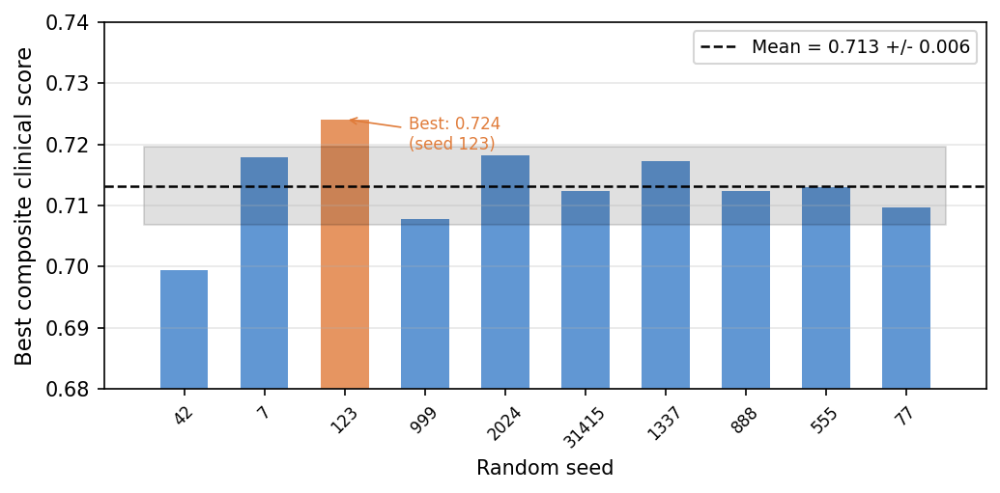
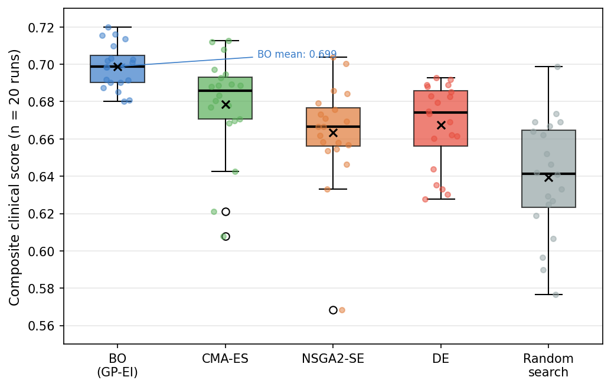
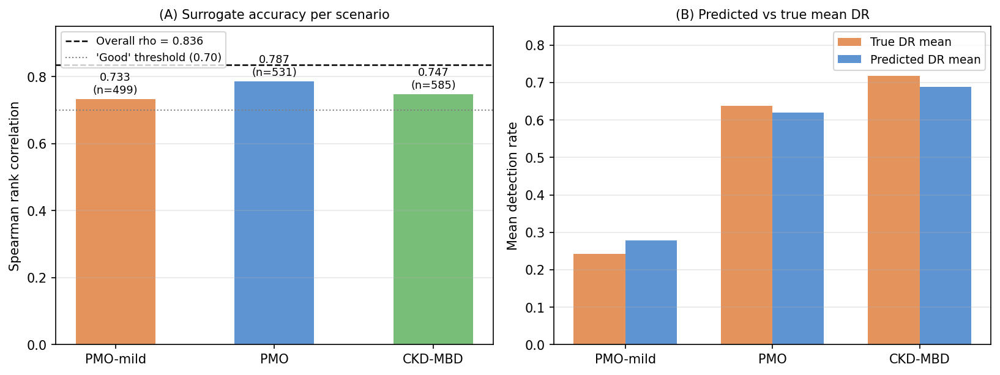
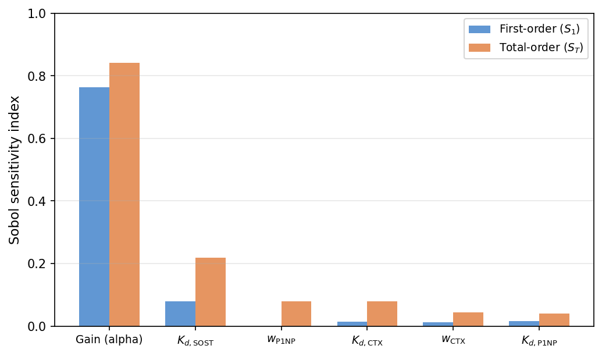
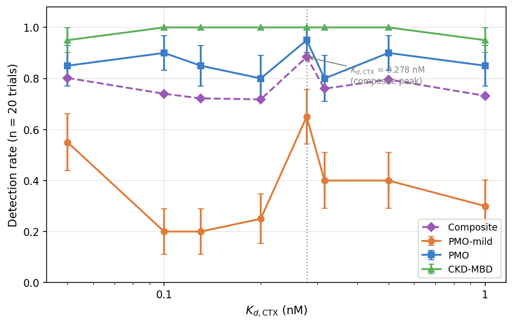
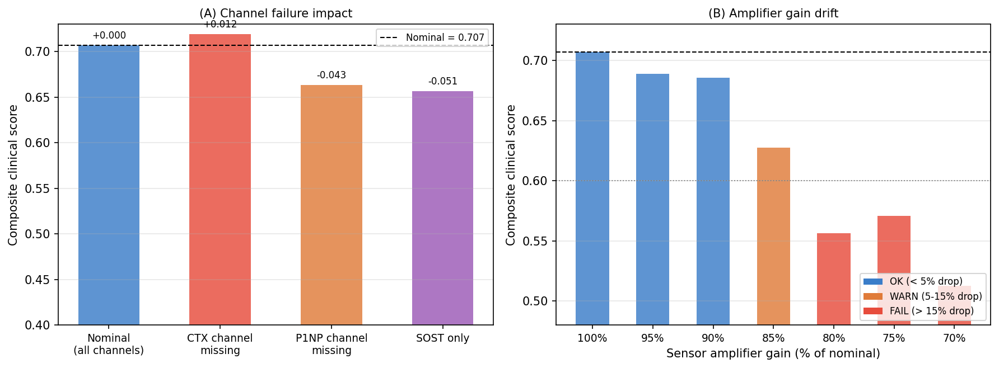
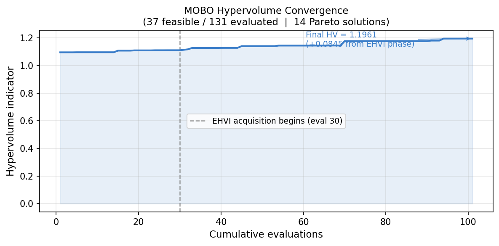
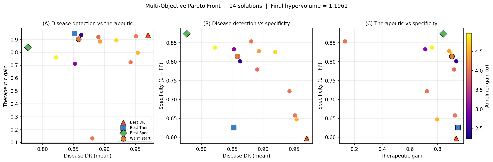

GENEVO: A simulation-driven framework for Bayesian optimisation of osteoporosis biosensor design

Abstract
Safe precision dosing of osteoanabolic agents requires real-time monitoring of bone turnover, but that is hindered by slow medical imaging. Electrochemical aptamer arrays measuring sclerostin (SOST), CTX, and P1NP could address this issue, but optimizing their six-dimensional design space over noisy, non-linear biological dynamics is a major challenge. Thus, we present GENEVO which combines a 14-species ordinary differential equation (ODE) bone microenvironment simulator with gradient boosting (GBM) surrogates and Bayesian optimization (BO) to design noise-robust biosensors. The surrogates accurately predict the simulated biosensors' target metrics (5-fold cross-validation AUC = 0.914, ρ = 0.835), allowing them to be accurate alternative representations of simulation outcomes. After benchmarking BO against other optimization algorithms, it scored the highest, outperforming random search by 9.3% (p < 0.0001) with a mean score of 0.699. This relatively strong score demonstrates the model's reliability in optimizing biosensor design. In simulator validation, the optimized array had a 65% detection rate (DR) for postmenopausal osteoporosis (PMO) and 85% DR for CKD-MBD cases, but struggled with mild PMO (35% DR) due to surrogate over-optimism at parameter limits. To resolve this, the BO loop was started with an optimized affinity of $K_{d,\text{CTX}}= 0.278$ nM, boosting the mild PMO DR to 65%. Finally, a Saltelli variance decomposition revealed that an array's amplifier gain affects 84.2% of the biosensor score variance, demonstrating that calibrating the signal transduction electronics is the most important factor in creating effective biosensors.

Keywords: biosensor, osteoporosis, ODE simulation, Bayesian optimisation

Introduction
Postmenopausal osteoporosis (PMO) affects around 200 million people worldwide, causing approximately 8.9 million fragility fractures each year and annual healthcare costs of USD $57 billion for the United States alone [1]. Moreover, the impaired mineral metabolism in patients with chronic kidney disease (CKD) often leads to CKD-mineral and bone disorder (CKD-MBD), affecting approximately 850 million people worldwide [2]. Despite the scale of this issue, diagnosis and treatment monitoring still rely on the slow and expensive dual-energy X-ray absorptiometry (DXA), which measures changes only after the bone loss has already occurred. Thus, DXA is not effective for capturing the early changes in bone turnover needed for proper therapeutic intervention [3].
Due to this gap, the need for real-time monitoring for prevention and osteoanabolic therapies has become increasingly important, especially due to the emergence of bone formation-inhibitors like romosozumab. In fact, clinical trials have shown that romosozumab reduced new vertebral fractures by 73% and increased lumbar spine bone mineral density by 13.3% after 12 months of treatment [3, 4], making it highly effective. However, even these treatments can not be deemed completely safe, which is why frequent real-time measurements of circulating bone turnover biomarkers are crucial. 
Specifically, there are three biomarkers that can provide a comprehensive picture of bone turnover together. First, sclerostin (SOST) is involved in osteocyte-mediated inhibition of bone formation and increases by approximately 1.5- to 3-fold in osteoporosis and CKD-MBD [5, 6]. C-terminal telopeptide (CTX) is a marker of bone resorption, whereas procollagen type I N-terminal propeptide (P1NP) can signal new bone formation [7, 8, 9]. While SOST alone can distinguish diseased and healthy patients, both CTX and P1NP are needed to truly differentiate the disease subtypes and tailor effective treatment responses.
To monitor these biomarkers in real-time, electrochemical aptamer biosensors are a promising method [10] that produces distinguishable electrical changes when particular proteins are present. Unlike antibodies, aptamers are synthetic nucleic acid ligands selected through Systematic Evolution of Ligands by EXponential enrichment (SELEX), making it have high specificity, low cost, long-term stability, and straightforward integration with electronic sensing devices [11, 12]. 
Yet, designing an effective multiplex biosensor for bone turnover is extremely challenging because multiple hardware parameters must be optimized simultaneously and the real bone microenvironment is more complex than standard mathematical models. The parameters include the dissociation constants of the three aptamer channels, the shared signal amplification gain, and the weighting assigned to two of the three biomarker channels. 
To address this challenge, GENEVO was developed as a simulation-driven framework that combines a mechanistic bone remodelling model with surrogate modelling and Bayesian optimization (BO). Instead of exhaustively evaluating every possible sensor configuration, BO learns the underlying performance interactions and efficiently identifies promising designs for further evaluation. While this has proven effective in fields such as materials discovery and machine learning [13, 14, 15], its application to biosensor hardware design is largely unexplored.

Methods
ODE Simulation and Disease Scenarios
The bone microenvironment was modeled as a 14-species ordinary differential equation (ODE) system (Table S1), implemented in Antimony using the Python Tellurium simulation library. The cell-population dynamics (osteoblast–osteoclast coupling) and RANKL/OPG signalling framework were adapted from Komarova et al. [16] and Pivonka et al. [17]. It simulates the interactions between SOST secretion, PTH signaling, and the RANKL/OPG pathway over a 600-second point-of-care assay. These processes regulate osteoblast and osteoclast activity, altering CTX and P1NP concentrations to produce the resorption-to-formation ratio that is used to distinguish healthy, early-stage PMO, established PMO, and CKD-MBD states. The initial biomarker concentrations for these patient profiles were calibrated to literature-reported population averages (Table 1) while log-normal noise was applied for biological variability [5, 7, 9, 18].

**Table 1.** Initial biomarker concentrations used for each simulated disease scenario.

| Scenario | SOST (nM) | CTX (nM) | P1NP (nM) | SOST vs. Healthy |
| :--- | ---: | ---: | ---: | ---: |
| Healthy | 0.375 | 0.200 | 0.350 | 1.0× |
| PMO-mild | 0.563 | 0.300 | 0.385 | 1.5× |
| PMO | 0.875 | 0.500 | 0.525 | 2.3× |
| CKD-MBD | 1.125 | 0.500 | 0.625 | 3.0× |

Biosensor Signal and Noise Model
The biomarker concentrations generated by the ODE model were converted into an electrochemical sensor signal using a three-channel aptamer array targeting SOST, CTX, and P1NP. When patient serum flows across the sensor, the analyte binding over time at each sensing electrode was modeled using Langmuir adsorption kinetics [19]:

$$\frac{d[A_i:\text{APT}_i]}{dt} = k_{\text{on},i}\,C_i(t)\bigl(\text{APT}_{i,\text{total}} - [A_i:\text{APT}_i]\bigr) - k_{\text{off},i}[A_i:\text{APT}_i] \tag{1}$$

where $i \in \{\text{SOST, CTX, P1NP}\}$, $[A_i:\text{APT}_i]$ is the bound analyte concentration, $\text{APT}_{i,\text{total}}$ is the immobilized aptamer density, $C_i(t)$ is the analyte concentration, and $k_{\text{on},i}$, $k_{\text{off},i}$ are the binding rate constants. 
To create noise-robust effective biosensors, their sensitivity would need to be at the greatest, which only happens when the fractional surface occupancy of each channel is 50%. Using the Langmuir equilibrium isotherm:

$$\theta_i(C_i) = \frac{C_i}{K_{d,i} + C_i} \quad \text{where} \quad K_{d,i} = \frac{k_{\text{off},i}}{k_{\text{on},i}} \tag{2}$$

where $K_{d,i}$ is the equilibrium dissociation constant. Since sensor sensitivity is greatest when $C_i \approx K_{d,i}$, the Bayesian optimizer must be able to adjust the $K_d$ values for each disease to maximize distinction between the patients' biomarker ranges.
The sensor's three channel outputs were then combined into a single normalized signal:

$$R(t) = \alpha \left[w_\text{SOST}\frac{\theta_\text{SOST}(t)}{\theta_{\text{SOST},h}} + w_\text{CTX}\frac{\theta_\text{CTX}(t)}{\theta_{\text{CTX},h}} + w_\text{P1NP}\frac{\theta_\text{P1NP}(t)}{\theta_{\text{P1NP},h}}\right] + \epsilon(t) \tag{3}$$

where $\theta_{i,h}$ is the healthy baseline occupancy, $\alpha$ is the amplifier gain, $w_i$ are the channel weighting coefficients, and $\epsilon(t) \sim \mathcal{N}(0, \sigma_\text{noise}^2)$ represents Gaussian measurement noise. The SOST weight is derived implicitly as $w_\text{SOST} = 1 - w_\text{CTX} - w_\text{P1NP}$; only $w_\text{CTX}$, $w_\text{P1NP}$, and $\alpha$ are free parameters. To be able to consistently detect the signal and output it through $R(t)$ effectively, the optimizer must tune the weights and amplifier gain.
To convert this continuous signal into a single discrete diagnosis, $R(t)$ passes through a persistence detector that requires the signal to remain above the threshold $\tau$ for 10 consecutive timesteps. This filters out transient noise and reduces false positives. The time-to-detection for each trial is capped within the simulation's 9000 second (2.5 hour) timespan.

Composite Score Function
For each biosensor configuration, the surrogate models predicted four per-scenario metrics: disease detection rate (DR), false-negative rate (FNR), false-positive rate (FPR), and mean time-to-detection (TTD). These were combined into a single composite objective:

$$\text{score} = \underbrace{0.40 \cdot \bar{B}}_{\text{therapeutic}} + \underbrace{0.25 \cdot \tilde{\text{DR}}}_{\text{detection}} + \underbrace{0.15 \cdot (1-\overline{\text{FNR}})}_{\text{miss rate}} + \underbrace{0.05 \cdot \left(1-\frac{\overline{\text{TTD}}}{9000}\right)}_{\text{speed}} - \underbrace{0.15 \cdot \text{FPR}_h}_{\text{false alarm}} - \pi \tag{4}$$

where $\bar{B}$ is the weighted mean BMD gain across disease scenarios (the primary therapeutic objective); $\tilde{\text{DR}} = 0.5\cdot\overline{\text{DR}} + 0.5\cdot\text{DR}_\text{min}$ balances mean and worst-case detection; $\overline{\text{FNR}}$ and $\overline{\text{TTD}}$ are means over the three disease scenarios; $\text{FPR}_h$ is the analytical false-alarm rate on healthy samples; and $\pi$ aggregates soft and hard constraint penalties for infeasible configurations. The weights sum to 1.0 (excluding the penalty $\pi$). The dominant term (0.40) rewards biosensor configurations whose signal contrast triggers appropriate drug dosing and BMD improvement, rather than detection rate alone.

Gradient Boosting Surrogate Models
Running the full ODE simulator for one biosensor configuration takes approximately 2 seconds, but since BO evaluates hundreds of candidate configurations, directly using the simulator would be inefficient. Instead, three gradient boosting machine (GBM) surrogate models were trained on 2000 ODE-simulated configurations to predict the simulator's performance metrics for any biosensor configuration. GBMs were chosen since they are adept at capturing the abrupt, non-linear transitions that occur with the Langmuir binding model and persistence detection thresholds [20].
The training data was generated using Latin Hypercube Sampling (LHS). Unlike random sampling, LHS divides each parameter range into equal intervals and samples once from every interval [21], allowing for more uniform coverage of the 6-dimensional design space. 

Bayesian Optimization
Bayesian optimization (BO) was used to identify the optimal sensor configuration by tuning six design parameters (Table 2). For any configuration explored, the GBM surrogate models would predict the results, which then forms the composite score. A Gaussian Process (GP) with a Matérn 5/2 kernel would then select new parameter combinations using the Expected Improvement (EI) acquisition function [13, 15].
The optimization began with 50 LHS-generated configurations, followed by 150 EI-guided iterations, for a total budget of 200 evaluations. This ran until the optimization was considered converged, which is when the best composite score improved by less than 0.005 over 30 consecutive iterations.

**Table 2.** Bayesian optimization search space and parameter bounds. $w_\text{SOST}$ is derived as $1 - w_\text{CTX} - w_\text{P1NP}$ and is not a free parameter.

| Parameter | Search Bounds | Operational Role |
| :--- | :--- | :--- |
| $K_{d,\text{SOST}}$ | 0.1 – 10.0 nM (log) | Sclerostin aptamer affinity |
| $K_{d,\text{CTX}}$ | 0.1 – 10.0 nM (log) | C-terminal telopeptide aptamer affinity |
| $K_{d,\text{P1NP}}$ | 0.1 – 10.0 nM (log) | N-terminal propeptide aptamer affinity |
| $\alpha$ (amplifier gain) | 0.5 – 5.0 (log) | Signal amplification |
| $w_\text{CTX}$ | 0.001 – 0.49 | CTX channel weighting coefficient |
| $w_\text{P1NP}$ | 0.001 – 0.49 | P1NP channel weighting coefficient |

Multi-Objective Bayesian Optimization
A multi-objective extension using Expected Hypervolume Improvement (EHVI) was run to map the Pareto frontier between mean disease detection rate, therapeutic tracking accuracy, and diagnostic specificity. The EHVI acquisition selects configurations that maximally expand the dominated hypervolume, enabling principled trade-off exploration without subjective weighting.

Global Sensitivity Analysis
Variance-based Sobol sensitivity analysis [22, 23] was applied to the trained GBM surrogates to decompose score variance across the six free parameters. The Saltelli estimator [22] with $N_\text{base} = 512$ produces first-order ($S_1$) and total-order ($S_T$) indices with $4{,}096$ total surrogate evaluations.

Results
Convergence and Benchmark Performance
Across ten randomly-chosen seeds, the BO loop consistently converged to a composite score of 0.713 ± 0.006 (Figure 1, Table 3), demonstrating the optimization was highly stable and explored the landscape expansively. The best-performing configuration came from Seed 123, achieving a peak score of 0.724 with the following optimized parameter set:

$$K_{d,\text{SOST}} = 0.233\text{ nM},\quad K_{d,\text{CTX}} = 10.0\text{ nM},\quad K_{d,\text{P1NP}} = 0.135\text{ nM}$$
$$\alpha = 2.129,\quad w_\text{CTX} = 0.490,\quad w_\text{P1NP} = 0.490$$

While a score in the low 0.700s might appear modest, a perfect 1.000 is biologically impossible. PMO biomarker shifts are heavily hindered by patient noise and false alarm rates, making the realistic score ceiling around 0.900. Therefore, the optimized score of 0.713 achieves roughly 80% of this realistic threshold, suggesting that the algorithm is able to capture a substantial portion of the exploitable signal. Note that $K_{d,\text{CTX}} = 10.0\text{ nM}$ and both weights at 0.49 indicate boundary exploitation — the surrogate over-estimated performance at the upper search bound, a phenomenon addressed in the Surrogate Diagnostics section.

**Figure 1.** Final composite score achieved by each of the ten BO runs. Mean ± SD shown as dashed line and shaded band. Seed 123 achieves the best score (0.724, highlighted).

**Table 3.** Per-seed BO convergence scores (n_init = 50, n_iter = 150, budget = 200 evaluations).

| Seed | Best Score |
| ---: | ---: |
| 42 | 0.699 |
| 7 | 0.718 |
| **123** | **0.724** |
| 999 | 0.708 |
| 2024 | 0.718 |
| 31415 | 0.712 |
| 1337 | 0.717 |
| 888 | 0.712 |
| 555 | 0.713 |
| 77 | 0.710 |
| **Mean ± SD** | **0.713 ± 0.006** |

To validate the BO's algorithmic success, it was benchmarked against four alternative search methods over 20 independent runs with 200 simulation evaluations each. BO achieved the highest mean score (0.699 ± 0.011), outperforming random search (0.639 ± 0.031) by 9.3% (Figure 2, Table 4). Moreover, the p < 0.0001 for wins = 19/20 suggests that this advantage of BO over the other methods is highly trustworthy, proving it to likely be the best method for biosensor design.

**Figure 2.** Score distributions from 20 independent runs of each optimiser. BO achieves the highest mean and highest minimum.

**Table 4.** Benchmark comparison of five search algorithms (20 independent runs × 200 evaluations each).

| Algorithm | Mean | SD | Min | Max |
| :--- | ---: | ---: | ---: | ---: |
| **BO (GP-EI)** | **0.699** | **0.011** | **0.680** | **0.720** |
| CMA-ES | 0.679 | 0.027 | 0.608 | 0.713 |
| DE | 0.668 | 0.022 | 0.628 | 0.693 |
| NSGA2-SE | 0.663 | 0.027 | 0.568 | 0.704 |
| Random | 0.639 | 0.031 | 0.576 | 0.699 |

Surrogate Diagnostics
To evaluate GENEVO's predictive accuracy, surrogate quality was assessed across 1,615 held-out configurations spanning all clinical scenarios. The surrogates showed an overall strong predictive accuracy (ρ = 0.836), with all individual clinical scenarios exceeding the 0.70 threshold for strong rank correlation (Figure 3A). This is shown in how precisely the predicted detection rates compare to the true simulated results: PMO-mild (24% true vs. 28% predicted), advanced PMO (64% true vs. 62% predicted), and CKD-MBD (72% true vs. 69% predicted) (Figure 3B).

To further validate the surrogate on an optimized design, the seed 888 champion configuration was cross-validated against the real ODE simulator (n = 20 trials per scenario). The surrogate predicted an 86% PMO-mild detection rate, whereas the real simulator yielded only 35%, resulting in a bias of −0.507. The root cause was boundary exploitation: the BO found $K_{d,\text{CTX}} = 10.0\text{ nM}$ (upper search bound), a region where the surrogate extrapolates optimistically but the Langmuir physics predicts saturation. This overestimation is addressed by the $K_{d,\text{CTX}}$ parameter scan in the following section.

**Figure 3.** (A) Spearman rank correlation per clinical scenario. All scenarios exceed the 0.70 "good" threshold. (B) Predicted vs. true mean DR per scenario.

Global Sensitivity Analysis
A Saltelli variance decomposition [22, 23] ($N_\text{base} = 512$; 4,096 total surrogate evaluations) was used to quantify the contribution of each design parameter to the composite score. Amplifier gain ($\alpha$) was the dominant variable, with a total-order Sobol index of $S_T = 0.842$, indicating that amplification and its interactions account for 84.2% of the score variance (Figure 4, Table 5). The next largest contributor was $K_{d,\text{SOST}}$ ($S_T = 0.219$), while all remaining affinity and weighting parameters each contributed $S_T < 0.10$.

**Figure 4.** First-order ($S_1$) and total-order ($S_T$) Sobol sensitivity indices. Amplifier gain dominates; aptamer affinity parameters are secondary.

**Table 5.** Global sensitivity indices for the six free parameters ($N_\text{base} = 512$, sorted by $S_T$).

| Parameter | $S_1$ | $S_T$ | Interaction ($S_T - S_1$) |
| :--- | ---: | ---: | ---: |
| $\alpha$ (amplifier gain) | 0.765 | **0.842** | 0.078 |
| $K_{d,\text{SOST}}$ | 0.079 | 0.219 | 0.140 |
| $w_\text{P1NP}$ | −0.002 | 0.080 | 0.082 |
| $K_{d,\text{CTX}}$ | 0.014 | 0.080 | 0.066 |
| $w_\text{CTX}$ | 0.013 | 0.043 | 0.030 |
| $K_{d,\text{P1NP}}$ | 0.016 | 0.040 | 0.024 |
| **Total interaction sum** | | | **0.418** |

A parameter sweep of CTX affinity showed there was a narrow optimum at $K_{d,\text{CTX}} = 0.278\text{ nM}$ (Figure 5) where the detection rate for early-stage PMO (PMO-mild) peaked dramatically at approximately 65%, compared to the neighboring 20–25% at lower affinities (Table 6). This rapid drastic performance reduction demonstrates that it is highly sensitive to affinity as they influence the distinguishability of early-stage disease with healthy states.

**Figure 5.** Simulated detection rate by scenario vs. $K_{d,\text{CTX}}$ (n = 20 trials per value). The composite peak at $K_{d,\text{CTX}} = 0.278\text{ nM}$ is sharp: a 14% increase in $K_d$ reduces the composite detection rate by 12.4 percentage points due to a steep drop in mild PMO sensitivity.

**Table 6.** $K_{d,\text{CTX}}$ parameter scan results (n = 20 trials per value, all other parameters held at seed 888 champion values).

| $K_{d,\text{CTX}}$ (nM) | PMO-mild DR | PMO DR | CKD-MBD DR | Composite |
| ---: | ---: | ---: | ---: | ---: |
| 0.05 | 0.55 | 0.85 | 0.95 | 0.802 |
| 0.10 | 0.20 | 0.90 | 1.00 | 0.740 |
| 0.13 | 0.20 | 0.85 | 1.00 | 0.722 |
| 0.20 | 0.25 | 0.80 | 1.00 | 0.718 |
| **0.278** | **0.65** | **0.95** | **1.00** | **0.884** |
| 0.316 | 0.40 | 0.80 | 1.00 | 0.760 |
| 0.50 | 0.40 | 0.90 | 1.00 | 0.796 |
| 1.00 | 0.30 | 0.85 | 0.95 | 0.732 |

Robustness Under Sensor Perturbations
Robustness was evaluated by introducing hardware failures, amplifier drift, biological noise, and baseline biomarker shifts into the optimized baseline configuration — the seed 888 champion with $K_{d,\text{CTX}} = 0.1\text{ nM}$, $K_{d,\text{SOST}} = 0.910\text{ nM}$, $\alpha = 2.023$ (Figure 6, Table 7). The nominal baseline score was 0.707.

Channel dropout experiments revealed that removing the CTX channel produced a marginal score increase (+0.012 to 0.719), consistent with the CTX channel operating in the saturation regime ($K_{d,\text{CTX}} = 0.1\text{ nM}$, Langmuir occupancy ≈ 0.67–0.83) where it contributes limited discrimination. Reducing to SOST only dropped the score to 0.656 (−7.2%), confirming that SOST is the dominant discrimination channel, while P1NP removal caused a similar −6.1% decline to 0.664.

The system remained stable under amplifier gain reduction down to 90% of nominal (score = 0.686, −3.0%), but then dropped sharply at 85% (score = 0.627, −11.2%), defining the warning threshold. Complete operational failure occurred below 80% nominal gain. Additionally, the system maintained robust performance under 4-fold biological noise amplification (5th-percentile score = 0.661, within 6.5% of baseline). Biomarker concentration shifts were asymmetric: a +10% global shift modestly improved the score (0.734, +3.8%), whereas a −30% shift caused signal loss (0.203, −71%), as all three channels fell below their detection thresholds simultaneously.

**Figure 6.** (A) Composite score under missing-channel scenarios. (B) Score under amplifier gain drift. CTX removal at the saturated $K_{d,\text{CTX}}= 0.1\text{ nM}$ configuration marginally improves score; gain drift causes progressive failure below 85% nominal.

**Table 7.** System vulnerability and robustness metrics under hardware and biochemical perturbations. Baseline uses the seed 888 champion configuration.

| Perturbation Type | Simulated Condition | Score | Impact |
| :--- | :--- | ---: | :--- |
| Baseline | Seed 888 champion ($K_{d,\text{CTX}}=0.1$ nM) | 0.707 | Reference |
| Channel Dropout | CTX channel removed ($w_\text{CTX}=0$) | 0.719 | Marginal (+1.7%) |
|  | P1NP channel removed ($w_\text{P1NP}=0$) | 0.664 | Minor (−6.1%) |
|  | SOST channel only | 0.656 | Moderate (−7.2%) |
| Hardware Drift | 95% nominal amplifier gain | 0.689 | OK (−2.5%) |
|  | 90% nominal amplifier gain | 0.686 | OK (−3.0%) |
|  | 85% nominal amplifier gain | 0.627 | Warning (−11.2%) |
|  | 80% nominal amplifier gain | 0.556 | Failure (−21.4%) |
|  | 70% nominal amplifier gain | 0.513 | Failure (−27.4%) |
| Biochemical Noise | 4× biological noise (p5 score) | 0.661 | Resilient |
| Patient Baseline | +10% biomarker concentration shift | 0.734 | Marginal (+3.8%) |
|  | −30% biomarker concentration shift | 0.203 | Signal lost (−71%) |

Multi-Objective Pareto Analysis
A final multi-objective Bayesian optimization (MOBO) loop was run to optimize mean disease detection rate ($\text{DR}_\text{mean}$), therapeutic tracking, and diagnostic specificity. Across 131 evaluations, 37 of them were feasible configurations, through which the algorithm produced a 14-point Pareto frontier and a final hypervolume of 1.196 (Figure 7). The highest $\text{DR}_\text{mean} = 0.970$ configuration achieved specificity 0.597, whereas the highest-specificity (1.000) configuration achieved $\text{DR}_\text{mean} = 0.776$ (Figure 8). 

**Figure 7.** Hypervolume convergence across 131 MOBO evaluations. The dashed line marks evaluation 30 (EHVI start). Steps indicate discrete Pareto front expansions. Final HV = 1.196.

**Figure 8.** Three 2D projections of the 14-point Pareto front coloured by amplifier gain ($\alpha$). (A) Disease DR vs. therapeutic gain. (B) Disease DR vs. specificity. (C) Therapeutic vs. specificity. The warm-start anchor (orange circle) shows that high single-objective scores are Pareto-feasible.

Discussion
Analysis
Detecting early-stage osteoporosis was significantly more difficult than detecting established disease because the biomarker concentrations were close to healthy baseline levels. Thus, a biosensor must be sensitive enough to distinguish the differences even when they are narrow. A parameter scan of the CTX aptamer affinity revealed that there was a narrow optimum around $K_{d,\text{CTX}} = 0.278\text{ nM}$, where the electrode's surface occupancy contrast between healthy and diseased samples increased from 7.3 to 22.5 percentage points. Deviating from this optimum results in drastic drops in performance, which previous studies of electrochemical aptamer biosensors similarly report as well that sensitivity is maximized when the dissociation constant closely matches the target analyte concentration [24, 25]. Therefore, this suggests that selecting an appropriate affinity window is extremely important compared to simply maximizing affinity. 
The robustness analysis also supports this conclusion. At the boundary-exploiting configuration ($K_{d,\text{CTX}} = 0.1\text{ nM}$, saturation regime), CTX channel removal did not reduce performance — it marginally improved the score (+1.7%). This is physically consistent: an aptamer operating well above $K_{d,\text{CTX}}$ is already near saturation in both healthy and disease states, contributing little discrimination. By contrast, reducing to SOST-only still maintained 93% of baseline performance, confirming that SOST is the primary discrimination driver. The amplifier gain sensitivity further reinforces this: gradual drift from nominal caused a progressive decline, showcasing that having a stable signal amplification would be crucial in maintaining accuracy.
Finally, the MOBO demonstrated that aptamers with the highest detection rates consistently sacrificed specificity in return, and vice versa, as increasing sensitivity generally increases false-positive rates due to the lower thresholds classifying more cases as positive [26]. Moreover, the hypervolume of 1.196 and its stable convergence suggests that the BO effectively explored the design space and approached the limits of the research's achievable performance within a simulated system.

Limitations
Despite the strong performance and mathematical validity of GENEVO, there are several limitations. First, all results were generated using a calibrated ODE simulator rather than longitudinal patient data, so there is a prominent simulation-to-reality gap. This limits the reliability of the surrogate models and Bayesian optimization (BO), particularly for challenging patient groups such as mild PMO, and prevents the framework from tailoring biosensor parameters to individual patients. Second, the BO consistently exploited the upper boundary of the $K_{d,\text{CTX}}$ search space (10.0 nM), indicating surrogate over-optimism in sparsely sampled regions; the physics-corrected affinity (0.278 nM) required a separate parameter scan to identify. Finally, although the Sobol analysis using $N_\text{base} = 512$ (4,096 total surrogate evaluations) was somewhat sufficient to identify the important contributors to biosensor score such as amplifier gain, it was less reliable for estimating the smaller effects of lower-importance parameters, making the BO less intelligent than ideal.

Future Work
The largest challenge for GENEVO is bridging the simulation-to-reality gap, which can be addressed through a clinical study spanning over healthy patients, ones with mild PMO, established PMO, and CKD-MBD patients. Rather than testing numerous physical biosensor variants, which would be expensive, the optimized design identified by GENEVO could be evaluated using serial serum biomarker measurements collected throughout treatment. This longitudinal data would extract patient-specific biomarker trajectories and variability in responses that cannot be fully represented by the current simulated noise model, allowing to calibrate both the ODE simulation and surrogate models. In particular, incorporating empirical measurements from mild PMO patients would address the surrogate overestimation observed in this study, as it would replace the over-optimistic estimation at parameter boundaries. The resulting calibrated framework could then support adaptive optimization of biosensor parameters for different patient subgroups, making the platform highly personalized. 

Conclusion
In summary, GENEVO is a simulation framework that integrates mechanistic ordinary differential equations (ODEs) with machine learning surrogates and Bayesian optimization to efficiently identify noise-robust biosensor configurations. Although BO reliably outperforms the other optimization alternatives, the inherent lack of real clinical data reduces the reliability of applying the results in the real world. Nevertheless, the core lessons of biosensor design are still relevant in that overall performance variance is primarily influenced by hardware constraints for electronic readout stability, and precise control over the transduction surface chemistry. Lastly, the resulting well-explored multi-objective Pareto frontier demonstrates that GENEVO is a successful blueprint in designing aptamers that balance competing objectives with high detection rates, strong robustness, accurate time-to-detection, and lowering false positives. 

References
[1] Johnell O, Kanis JA. An estimate of the worldwide prevalence and disability associated with osteoporotic fractures. Osteoporos Int. 2006;17(12):1726-1733.

[2] Hill NR, Fatoba ST, Oke JL, Hirst JA, O'Callaghan CA, Lasserson DS, Hobbs FDR. Global prevalence of chronic kidney disease — a systematic review and meta-analysis. PLoS One. 2016;11(7):e0158765.

[3] Cosman F, Crittenden DB, Adachi JD, Binkley N, Czerwinski E, Ferrari S, et al. Romosozumab treatment in postmenopausal women with osteoporosis. N Engl J Med. 2016;375(16):1532-1543.

[4] McClung MR, Grauer A, Boonen S, Bolognese MA, Brown JP, Diez-Perez A, et al. Romosozumab in postmenopausal women with low bone mineral density. N Engl J Med. 2014;370(5):412-420.

[5] Mirza FS, Padhi ID, Raisz LG, Lorenzo JA. Serum sclerostin levels negatively correlate with parathyroid hormone levels and free estrogen index in postmenopausal women. J Clin Endocrinol Metab. 2010;95(4):1991-1997.

[6] Poole KES, van Bezooijen RL, Loveridge N, Hamersma H, Papapoulos SE, Löwik CWGM, Reeve J. Sclerostin is a delayed secreted product of osteocytes that inhibits bone formation. FASEB J. 2005;19(13):1842-1844.

[7] Garnero P, Sornay-Rendu E, Chapuy MC, Delmas PD. Increased bone turnover in late postmenopausal women is a major determinant of osteoporosis. J Bone Miner Res. 1996;11(3):337-349.

[8] LeBoff MS, Greenspan SL, Insogna KL, Lewiecki EM, Saag KG, Singer AJ, et al. The clinician's guide to prevention and treatment of osteoporosis. Osteoporos Int. 2022;33(10):2049-2102.

[9] Vasikaran S, Eastell R, Bruyère O, Foldes AJ, Garnero P, Griesmacher A, et al. Markers of bone turnover for the prediction of fracture risk and monitoring of osteoporosis treatment: a need for international reference standards. Osteoporos Int. 2011;22(2):391-420.

[10] Sinha A, Mukherjee K, Bhattacharyya TK. Simultaneous detection of multiple cancer biomarkers using a flexible electrochemical aptasensor array. Biosens Bioelectron. 2019;137:157-165.

[11] Tuerk C, Gold L. Systematic evolution of ligands by exponential enrichment: RNA ligands to bacteriophage T4 DNA polymerase. Science. 1990;249(4968):505-510.

[12] Stoltenburg R, Reinemann C, Strehlitz B. SELEX—a (r)evolutionary method to generate high-affinity nucleic acid ligands. Biomol Eng. 2007;24(4):381-403.

[13] Snoek J, Larochelle H, Adams RP. Practical Bayesian optimization of machine learning algorithms. In: Pereira F, Burges CJC, Bottou L, Weinberger KQ, editors. Advances in Neural Information Processing Systems 25. Red Hook (NY): Curran Associates; 2012. p. 2951-2959.

[14] Shahriari B, Swersky K, Wang Z, Adams RP, de Freitas N. Taking the human out of the loop: a review of Bayesian optimization. Proc IEEE. 2016;104(1):148-175.

[15] Jones DR, Schonlau M, Welch WJ. Efficient global optimization of expensive black-box functions. J Glob Optim. 1998;13(4):455-492.

[16] Komarova SV, Smith RJ, Dixon SJ, Sims SM, Wahl LM. Mathematical model predicts a critical role for osteoclast autocrine regulation in the control of bone remodeling. Bone. 2003;33(2):206-215.

[17] Pivonka P, Zimak J, Smith DW, Gardiner BS, Dunstan CR, Sims NA, et al. Model structure and control of bone remodeling: a theoretical study. Bone. 2008;43(2):249-263.

[18] Kidney Disease: Improving Global Outcomes (KDIGO) CKD-MBD Update Work Group. KDIGO 2017 Clinical Practice Guideline Update for the diagnosis, evaluation, prevention, and treatment of chronic kidney disease-mineral and bone disorder (CKD-MBD). Kidney Int Suppl (2011). 2017;7(1):1-59.

[19] Langmuir I. The adsorption of gases on plane surfaces of glass, mica and platinum. J Am Chem Soc. 1918;40(9):1361-1403.

[20] Friedman JH. Greedy function approximation: a gradient boosting machine. Ann Stat. 2001;29(5):1189-1232.

[21] McKay MD, Beckman RJ, Conover WJ. A comparison of three methods for selecting values of input variables in the analysis of output from a computer code. Technometrics. 1979;21(2):239-245.

[22] Saltelli A. Making best use of model evaluations to compute sensitivity indices. Comput Phys Commun. 2002;145(2):280-297.

[23] Sobol IM. Sensitivity estimates for nonlinear mathematical models. Math Model Comput Exp. 1993;1(4):407-414.

[24] Ferguson BS, Hoggarth DA, Maliniak D, Ploense K, White RJ, Woodward N, et al. Real-time, aptamer-based tracking of circulating therapeutic agents in living animals. Sci Transl Med. 2013;5(213):213ra165.

[25] Lubin AA, Plaxco KW. Folding-based electrochemical biosensors: the case for responsive nucleic acid architectures. Acc Chem Res. 2010;43(4):496-505.

[26] Plaxco KW, Soh HT. Switch-based biosensors: a new approach toward real-time, in vivo molecular detection. Trends Biotechnol. 2011;29(1):1-5.

Appendix
**Table S1.** Complete 14-species ODE bone microenvironment model. Boundary species Estrogen (E) and PTH (P) are held constant and are not counted among the 14 dynamic species.

| Species | Compartment | Biological Role | ODE Rate Law | Healthy IC |
| :--- | :--- | :--- | :--- | ---: |
| Sclerostin_bone | bone | Osteocyte-secreted Wnt inhibitor; inhibits osteoblast differentiation | $k_{\text{prod,Scl}} \cdot \text{Ocy} \cdot f_E \cdot f_P - k_{\text{deg,Scl}} \cdot [\text{Scl}_b]$ | 0.015 nM |
| Sclerostin_sensor | sensor | Sclerostin diffused into sensor chamber; detected by aptamer | $k_{\text{diff,Scl}} \cdot [\text{Scl}_b] - k_{\text{back,Scl}} \cdot [\text{Scl}_s] \cdot V_s$ | 0.375 nM |
| RANKL_bone | bone | Osteoblast-secreted osteoclast activator; inhibited by estrogen | $k_{\text{prod,RL}} \cdot \text{OB} \cdot g_E - k_{\text{deg,RL}} \cdot [\text{RL}_b]$ | 0.5 nM |
| RANKL_sensor | sensor | RANKL diffused into sensor chamber | $k_{\text{diff,RL}} \cdot [\text{RL}_b] - k_{\text{back,RL}} \cdot [\text{RL}_s] \cdot V_s$ | 15.0 nM |
| OPG_bone | bone | Osteoblast-secreted decoy receptor; inhibits RANKL-driven osteoclastogenesis | $k_{\text{prod,OPG}} \cdot \text{OB} \cdot h_E \cdot h_P - k_{\text{deg,OPG}} \cdot [\text{OPG}_b]$ | 5.0 nM |
| OPG_sensor | sensor | OPG diffused into sensor chamber | $k_{\text{diff,OPG}} \cdot [\text{OPG}_b] - k_{\text{back,OPG}} \cdot [\text{OPG}_s] \cdot V_s$ | 150.0 nM |
| Osteocytes | bone | Long-lived bone cells; primary source of sclerostin | $k_{\text{prod,Ocy}} \cdot \text{OB} - k_{\text{death,Ocy}} \cdot \text{Ocy}$ | 4.0 (cells) |
| Osteoblasts | bone | Bone-forming cells; regulated by sclerostin | $k_{\text{diff,OB}} \cdot \frac{1}{1+[\text{Scl}_b]/K_{\text{scl,OB}}} - k_{\text{apop,OB}} \cdot \text{OB}$ | 2.0 (cells) |
| Osteoclasts | bone | Bone-resorbing cells; regulated by RANKL/OPG ratio | $k_{\text{diff,OC}} \cdot \frac{[\text{RL}_b]^n}{K_{\text{RL,OC}}^n + [\text{RL}_b]^n} \cdot \frac{1}{1+[\text{OPG}_b]/K_\text{OPG}} - k_{\text{apop,OC}} \cdot \text{OC}$ | 0.3 (cells) |
| MineralIon | bone | Bone mineral; produced under PTH stimulation, consumed by osteoblasts | $k_{\text{prod,Min}} \cdot (1 + \text{PTH}/100) - k_{\text{loss,Min}} \cdot [\text{Min}] \cdot \text{OB}$ | 2.5 nM |
| CTX_bone | bone | Bone resorption marker; produced by osteoclasts during collagen breakdown | $k_{\text{prod,CTX}} \cdot \text{OC} - k_{\text{deg,CTX}} \cdot [\text{CTX}_b]$ | 0.008 nM |
| CTX_sensor | sensor | CTX diffused into sensor chamber; detected by aptamer | $k_{\text{diff,CTX}} \cdot [\text{CTX}_b] - k_{\text{back,CTX}} \cdot [\text{CTX}_s] \cdot V_s$ | 0.200 nM |
| P1NP_bone | bone | Bone formation marker; produced by osteoblasts during collagen synthesis | $k_{\text{prod,P1NP}} \cdot \text{OB} - k_{\text{deg,P1NP}} \cdot [\text{P1NP}_b]$ | 0.014 nM |
| P1NP_sensor | sensor | P1NP diffused into sensor chamber; detected by aptamer | $k_{\text{diff,P1NP}} \cdot [\text{P1NP}_b] - k_{\text{back,P1NP}} \cdot [\text{P1NP}_s] \cdot V_s$ | 0.350 nM |

Regulatory function abbreviations: $f_E = 1/(1 + (E/K_{E,\text{Scl}})^2)$ (estrogen inhibition of sclerostin); $f_P = 1/(1 + (P/K_{P,\text{Scl}})^{1.5})$ (PTH mild inhibition of sclerostin); $g_E = 1 + 2/(1 + (E/K_{E,\text{RL}})^2)$ (estrogen inhibition of RANKL); $h_E = 0.5 + 1.5 \cdot E/(E + K_{E,\text{RL}})$ (estrogen stimulation of OPG); $h_P = 1/(1 + (P/K_{P,\text{OPG}}))$ (PTH inhibition of OPG); $V_s = 0.1$ L (sensor chamber volume). All diffusion equilibrium ratios: sensor/bone = 25× at steady state.

**Rate law sources.** Osteoblast, osteoclast, and osteocyte dynamics and their coupling (Osteocytes, Osteoblasts, Osteoclasts rows) were adapted from Komarova et al. [16]. RANKL and OPG production, regulation, and cross-inhibition were adapted from Pivonka et al. [17]. Sclerostin secretion kinetics and its estrogen/PTH regulatory functions were derived from Mirza et al. [5] and Poole et al. [6]. CTX and P1NP production and degradation equations are phenomenological first-order models calibrated to population biomarker concentrations reported by Garnero et al. [7] and Vasikaran et al. [9]. All bone-to-sensor diffusion equations (sensor compartment rows) are original to this work.
